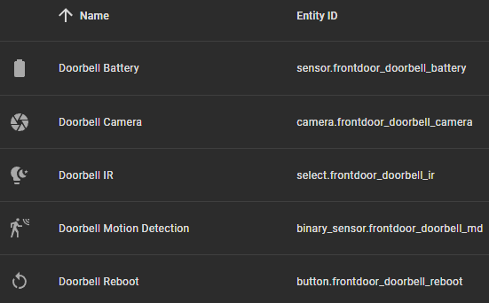

# neolink-interval

[neolink](https://github.com/quantumentangledandy) is a Rust application that adds capabilities to Reolink cameras. For battery-powered cameras that don't natively support RTSP streaming, it can extract information and provide an RTSP stream. It can also publish data to an mqtt broker, which is what this project is for.

Although neolink has options to configure interval-based operation, the recent versions have a few bugs or issues that could lead to draining the camera's battery. This container adds scheduling to start and kill neolink on a timing interval. You can configure the interval in a docker compose file. neolink-interval will run neolink for 20 seconds, kill the process, and then wait for the specified interval before repeating the behavior.

## Getting started

Using docker compose:

```bash
services:
  neolink:
    image: ghcr.io/voltagesolutions/neolink-interval:latest
    container_name: neolink
    restart: unless-stopped
    network_mode: host
    volumes:
      - /etc/localtime:/etc/localtime:ro
      - ./config.toml:/etc/neolink.toml
    environment:
      NEO_LINK_MODE: "mqtt"
      NEO_LINK_INTERVAL: "270"
```

Using docker run:

```bash
docker run -d \
  --name neolink \
  --restart unless-stopped \
  --network host \
  -v /etc/localtime:/etc/localtime:ro \
  -v $(pwd)/config.toml:/etc/neolink.toml \
  -e NEO_LINK_MODE=mqtt \
  -e NEO_LINK_INTERVAL=270 \
  ghcr.io/voltagesolutions/neolink-interval:latest
```

Sample config.toml:

```toml
# Expose on all networks
bind = "0.0.0.0"

# Doorbell Camera
[[cameras]]
name = "frontdoor"
username = "REOLINK_CAMERA_USERNAME_HERE"
password = "REOLINK_CAMERA_PASSWORD_HERE"
uid = "REOLINK_CAMERA_UID_HERE"
address = "REOLINK_CAMERA_IPADDRESS_HERE"
discovery = "local"

[cameras.mqtt]
  [cameras.mqtt.discovery]
  topic = "MQTT_TOPIC_HERE""
  features = ["Camera","ir","Motion","Reboot","Battery"]

[mqtt]
broker_addr= "BROKER_IP_ADDRESS_HERE"
port = 1883
credentials = ["MQTT_BROKER_USERNAME_HERE", "MQTT_BROKER_PASSWORD_HERE"]
```

## Example usage

I am using neolink to gain access to a [Reolink Battery Doorbell](https://reolink.com/product/reolink-doorbell-battery/). This is a doorbell camera that trickle-charges off of the doorbell circuit and uses an existing standard doorbell chime. Through experimentation, I have found that when I configure the wait time to 270 seconds, the Battery Doorbell is able to maintain its level of charge. 240 seconds will slowly discharge it.

I am using Home Assistant as an MQTT broker.


